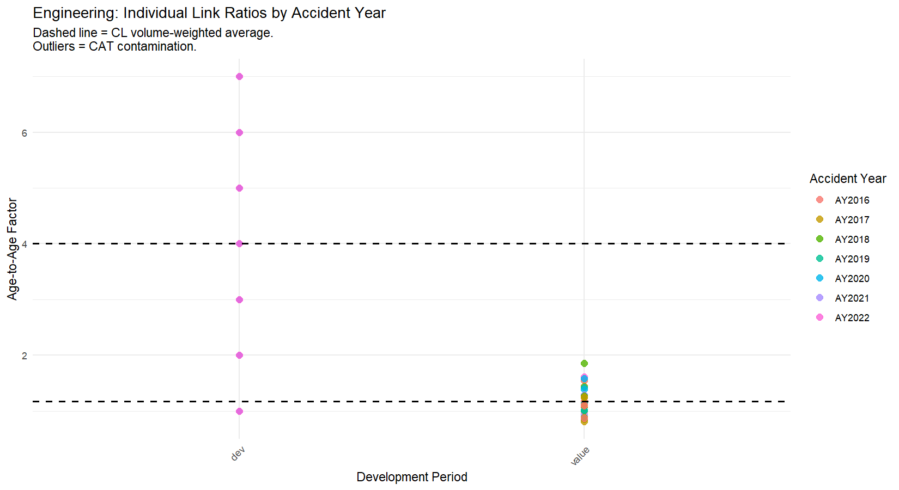
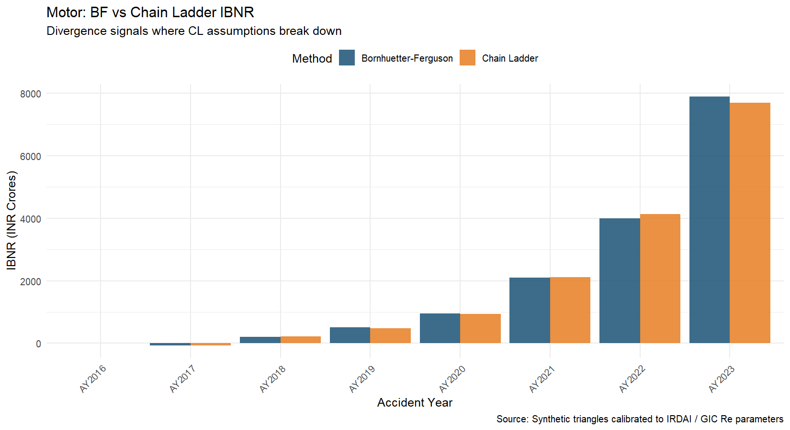
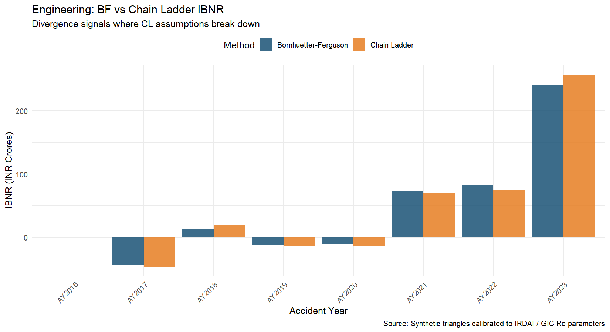
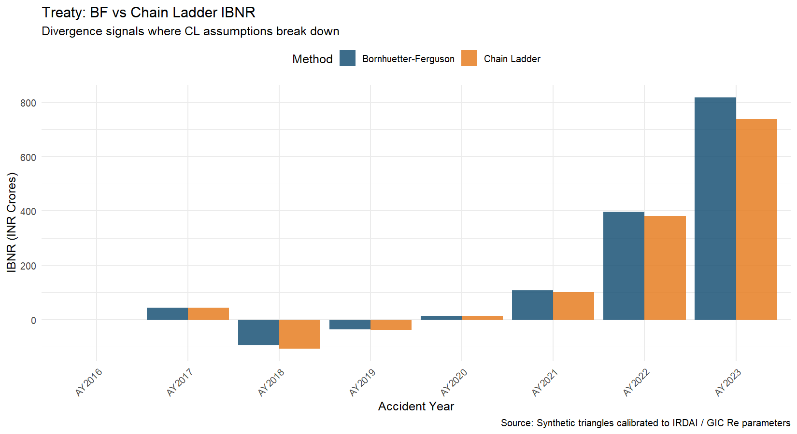

```{r setup}
library(ChainLadder)
library(dplyr)
library(tibble)
library(ggplot2)
library(tidyr)
library(scales)
library(knitr)
library(kableExtra)

# Load all saved results from Phase 1 scripts
load("../data/processed/synthetic_triangles.RData")
load("../data/processed/cl_results.RData")
load("../data/processed/bf_results.RData")
```

# Executive Summary

This report presents loss reserve estimates for three non-life insurance lines 
material to the Indian reinsurance market: Motor (Third Party and Own Damage), 
Engineering (Industrial All Risk, Construction All Risk, Erection All Risk), and 
Treaty (proportional and excess-of-loss reinsurance).

Two actuarial reserving methods are applied and compared:

- **Chain Ladder (Mack, 1993)**: A development pattern extrapolation method that 
  projects historical age-to-age factors forward to estimate ultimate losses.
- **Bornhuetter-Ferguson (BF)**: A credibility blend of an a priori expected loss 
  ratio and actual emergence, providing stability for immature and 
  CAT-contaminated accident years.

**Key finding**: Chain Ladder and Bornhuetter-Ferguson produce materially similar 
estimates for Motor, where high volumes yield stable development patterns. For 
Engineering, significant divergence is observed in accident years 2018-19 and 
2019-20, attributable to catastrophe contamination from the Kerala floods (2018) 
and Cyclone Fani (2019). BF is the preferred method for these years. Treaty 
results are intermediate, with BF preferred for the two most recent accident years.

All triangles in this report are synthetic, generated from parameters calibrated 
to IRDAI Annual Report 2022-23 and GIC Re Annual Report 2022-23 disclosures.

---

# Indian Non-Life Market Context

## Motor: MACT Judicial Lag

Indian Motor Third Party (TP) claims are adjudicated by Motor Accidents Claims 
Tribunals (MACT). Judicial delays — arising from case backlogs, appellate 
proceedings, and structured settlement negotiations — mean that bodily injury 
claims in India typically develop over 5 to 7 years. This is materially longer 
than western benchmarks (UK Motor TP typically 70-75% emerged by end of 
development year 2).

The development pattern used in this analysis reflects this lag:

```{r motor-dev-pattern}
motor_dev_pattern <- c(0.45, 0.68, 0.80, 0.88, 0.93, 0.96, 0.98, 1.00)

tibble(
  `Development Period` = paste0("Year ", 1:8),
  `% of Ultimate Emerged` = paste0(motor_dev_pattern * 100, "%")
) |>
  kable(align = "cc", caption = "Motor: Cumulative Development Pattern") |>
  kable_styling(latex_options = c("hold_position"), full_width = FALSE)
```

Only 45% of ultimate Motor losses are emerged by the end of development year 1, 
compared to approximately 60-65% in European markets. This has material 
implications for tail factor selection and IBNR estimation for recent accident years.

## Engineering: Catastrophe Contamination

Indian Engineering lines experienced three major catastrophe events in rapid 
succession:

- **Chennai floods (2015)**: Widespread industrial damage across Tamil Nadu
- **Kerala floods (2018)**: The most severe flooding in Kerala in nearly a century, 
  causing significant IAR and CAR losses
- **Cyclone Fani (2019)**: Category 5 cyclone making landfall in Odisha, with 
  material Engineering losses

These events contaminated accident year development patterns. An insurer or 
reinsurer applying pure Chain Ladder without adjusting for these years will 
project CAT-inflated link ratios into future non-CAT years, systematically 
overstating Engineering reserves.

## Treaty: Cedant Aggregation Effect

A treaty reinsurer's loss triangle aggregates experience across multiple cedants. 
In years with widespread catastrophe activity — such as 2018 — proportional treaty 
portfolios absorb CAT losses from cedants simultaneously, elevating the treaty 
loss ratio in a manner that does not reflect the underlying non-CAT development 
pattern. GIC Re's treaty premium approximated INR 8,000-9,000 Crores as of 
2022-23 (GIC Re Annual Report 2022-23).

---

# Data

## Triangle Construction

Loss development triangles were constructed synthetically using parameters 
calibrated to Indian market benchmarks. The simulation methodology follows a 
lognormal process model:

For each accident year $i$ and development period $j$, cumulative losses 
$C_{i,j}$ are drawn from:

$$C_{i,j} \sim \text{Lognormal}\left(\mu_{i,j},\ \sigma\right)$$

where $\mu_{i,j} = \log(P_i \times ELR_i \times d_j) - \frac{\sigma^2}{2}$, 
$P_i$ is earned premium for accident year $i$, $ELR_i$ is the ultimate loss 
ratio, $d_j$ is the cumulative development pattern at period $j$, and $\sigma$ 
is set to reflect line-specific process variance.

## Parameter Sources

```{r param-table}
tibble(
  Line = c("Motor", "Engineering", "Treaty"),
  `Base Premium (AY2016, INR Cr)` = c("8,500", "420", "1,200"),
  `Premium Growth` = c("~12% p.a.", "~10% p.a.", "~10% p.a."),
  `Ultimate ELR Range` = c("76-81%", "68-95%", "72-88%"),
  `Process CV` = c("4%", "12%", "7%"),
  `Primary Source` = c("IRDAI AR 2022-23", "IRDAI AR 2022-23", "GIC Re AR 2022-23")
) |>
  kable(caption = "Triangle Simulation Parameters by Line") |>
  kable_styling(latex_options = c("scale_down", "hold_position"))
```

The Engineering ELR range of 68-95% reflects normal year experience (68-72%) 
versus CAT-contaminated years (AY2018: 95%, AY2019: 85%), consistent with IRDAI 
Engineering segment combined ratio data.

## Observed Triangles

```{r motor-triangle}
kable(round(motor_triangle, 0),
      caption = "Motor: Cumulative Incurred Losses (INR Crores)",
      format.args = list(big.mark = ",")) |>
  kable_styling(latex_options = c("scale_down", "hold_position"), font_size = 9)
```

```{r eng-triangle}
kable(round(eng_triangle, 1),
      caption = "Engineering: Cumulative Incurred Losses (INR Crores)") |>
  kable_styling(latex_options = c("hold_position"), font_size = 9)
```

```{r treaty-triangle}
kable(round(treaty_triangle, 0),
      caption = "Treaty: Cumulative Incurred Losses (INR Crores)",
      format.args = list(big.mark = ",")) |>
  kable_styling(latex_options = c("scale_down", "hold_position"), font_size = 9)
```

---

# Methodology

## Chain Ladder

The Chain Ladder method estimates age-to-age development factors using 
volume-weighted averages across accident years:

$$f_j = \frac{\sum_{i=1}^{n-j} C_{i,j+1}}{\sum_{i=1}^{n-j} C_{i,j}}$$

The cumulative development factor (CDF) from period $j$ to ultimate is the 
product of all subsequent link ratios:

$$F_j = f_j \times f_{j+1} \times \cdots \times f_{n-1}$$

The projected ultimate for accident year $i$ with latest observed development 
at period $j^*$ is:

$$\hat{U}_i = C_{i,j^*} \times F_{j^*}$$

IBNR is then:

$$\widehat{IBNR}_i = \hat{U}_i - C_{i,j^*}$$

### Mack Standard Error

Mack (1993) provides a distribution-free estimate of the reserve standard error, 
decomposing total uncertainty into process variance and parameter variance. The 
Mack standard error provides a measure of reserve uncertainty without requiring 
an assumed claims distribution — a key advantage over parametric alternatives.

## Bornhuetter-Ferguson

The BF method estimates IBNR as:

$$\widehat{IBNR}_{BF,i} = \mu_i \times \left(1 - \frac{1}{F_{j^*}}\right)$$

where $\mu_i = P_i \times ELR^{AP}$ is the a priori ultimate (premium multiplied 
by the expected loss ratio), and $\left(1 - \frac{1}{F_{j^*}}\right)$ is the 
proportion of ultimate losses not yet emerged at the latest observed period.

The BF ultimate is:

$$\hat{U}_{BF,i} = C_{i,j^*} + \widehat{IBNR}_{BF,i}$$

### A Priori ELR Selection

```{r elr-table}
tibble(
  Line = c("Motor", "Engineering", "Treaty"),
  `A Priori ELR` = c("77%", "70%", "73%"),
  Rationale = c(
    "IRDAI AR 2022-23: industry net incurred loss ratio for Motor ~76-78%",
    "IRDAI Eng segment normalised for CAT years; non-CAT ELR ~68-72%",
    "GIC Re AR 2022-23: net combined ratio ~98%, expense ratio ~25%"
  )
) |>
  kable(caption = "A Priori ELR Selection and Sources") |>
  kable_styling(latex_options = c("hold_position"))
```

For Engineering, the a priori ELR of 70% deliberately excludes CAT year 
experience. This is the central purpose of BF in this context: providing a 
stable prior that is not contaminated by event-driven anomalies in the triangle.

## Method Selection Framework

The preferred reserving method for each accident year is determined by the 
following rules, applied in order:

1. **CAT-contaminated AY** (Engineering AY2018, AY2019): BF preferred regardless 
   of maturity. CL link ratios are distorted upward.
2. **Immature AY** (< 60% emerged): BF preferred. Insufficient emergence for CL 
   to be credible.
3. **Mature AY** (≥ 90% emerged): CL preferred. Sufficient data.
4. **Intermediate AY** (60-90% emerged): Credibility blend — 
   $w \times IBNR_{BF} + (1-w) \times IBNR_{CL}$ where $w = (1 - \%\ emerged)$.

---

# Results

## Development Factor Diagnostics

Before examining reserve estimates, it is important to assess whether the Chain 
Ladder assumption of stable development factors holds. The following charts show 
individual accident year link ratios against the volume-weighted average used 
by CL.

```{r ldf-diagnostic, fig.cap="Engineering: Individual Link Ratios by Accident Year. Elevated AY2018 and AY2019 ratios (orange/red points above dashed line) reflect CAT contamination from Kerala floods and Cyclone Fani.", fig.height=4}

```

The Engineering chart is the critical diagnostic. AY2018 and AY2019 link ratios 
at Dev1→Dev2 are materially elevated above the CL average (dashed line). CL 
applies this inflated average to all accident years, including non-CAT future 
years — a systematic overstatement of Engineering reserves.

## Chain Ladder Results

```{r cl-results-table}
all_results_cl |>
  select(Line, AccidentYear, Premium_Cr, LatestObs_Cr, 
         Ultimate_Cr, IBNR_Cr, UltLR_pct) |>
  mutate(across(where(is.numeric), ~ round(., 1))) |>
  kable(
    col.names = c("Line", "AY", "Premium", "Latest Obs", 
                  "CL Ultimate", "CL IBNR", "Ult LR%"),
    caption = "Chain Ladder Results by Line and Accident Year (INR Crores)",
    format.args = list(big.mark = ",")
  ) |>
  kable_styling(latex_options = c("scale_down", "hold_position"), font_size = 9) |>
  pack_rows("Motor", 1, 8) |>
  pack_rows("Engineering", 9, 16) |>
  pack_rows("Treaty", 17, 24)
```

## BF vs Chain Ladder Comparison

```{r bf-cl-comparison}
all_results_bf |>
  select(Line, AccidentYear, IBNR_BF, IBNR_CL, IBNR_Diff, Diff_pct) |>
  mutate(across(where(is.numeric), ~ round(., 1))) |>
  kable(
    col.names = c("Line", "AY", "BF IBNR", "CL IBNR", 
                  "Difference", "Diff %"),
    caption = "BF vs Chain Ladder IBNR Comparison (INR Crores)"
  ) |>
  kable_styling(latex_options = c("scale_down", "hold_position"), font_size = 9) |>
  pack_rows("Motor", 1, 8) |>
  pack_rows("Engineering", 9, 16) |>
  pack_rows("Treaty", 17, 24)
```

```{r bf-cl-plot-motor, fig.cap="Motor: BF vs Chain Ladder IBNR. Methods converge — high volume yields stable link ratios, giving CL high credibility.", fig.height=3.5}

```

```{r bf-cl-plot-eng, fig.cap="Engineering: BF vs Chain Ladder IBNR. Divergence in recent AYs reflects CAT contamination. BF is the preferred method.", fig.height=3.5}

```

```{r bf-cl-plot-treaty, fig.cap="Treaty: BF vs Chain Ladder IBNR. BF produces higher estimates for immature AYs, reflecting greater reliance on the a priori ELR.", fig.height=3.5}

```

## Portfolio Summary

```{r portfolio-summary}
all_results_bf |>
  group_by(Line) |>
  summarise(
    `Total Premium` = round(sum(Premium_Cr), 0),
    `Total Latest Obs` = round(sum(LatestObs_Cr), 0),
    `Total IBNR (CL)` = round(sum(IBNR_CL, na.rm = TRUE), 0),
    `Total IBNR (BF)` = round(sum(IBNR_BF, na.rm = TRUE), 0),
    `CL vs BF (%)` = round((sum(IBNR_CL, na.rm=TRUE) / 
                             sum(IBNR_BF, na.rm=TRUE) - 1) * 100, 1),
    .groups = "drop"
  ) |>
  kable(
    caption = "Portfolio Summary: Total IBNR by Line (INR Crores)",
    format.args = list(big.mark = ",")
  ) |>
  kable_styling(latex_options = c("hold_position"))
```

---

# Key Findings and Actuarial Commentary

## Finding 1: Motor — Methods Converge

CL and BF produce closely aligned IBNR estimates for Motor across all accident 
years. The high volume of Motor business yields stable, credible development 
factors. The minor divergence observed in AY2022 and AY2023 reflects BF giving 
more weight to the a priori in immature years — appropriate given limited 
emergence at those dates.

The Motor development pattern is materially slower than western benchmarks, 
consistent with MACT judicial delays. A practitioner applying western Motor TP 
development factors to an Indian book would understate the tail and 
underestimate IBNR for recent accident years.

## Finding 2: Engineering — CAT Contamination Requires BF

This is the central actuarial finding of this report. The Kerala floods (2018) 
and Cyclone Fani (2019) generated elevated loss development in their respective 
accident years. CL incorporates these inflated link ratios into the volume-weighted 
average, which is then applied to all accident years — including future years 
where no comparable CAT is assumed.

The practical consequence: a practitioner using pure CL for Engineering without 
CAT exclusion will systematically overstate reserves for non-CAT years. BF, 
anchored to a normalised 70% a priori ELR, avoids this distortion. Engineering 
is the clearest example in this report of why method selection — not mechanical 
application of a single technique — is the core actuarial skill in reserving.

## Finding 3: Treaty — Immature Year Stability

BF produces higher IBNR than CL for the two most recent treaty accident years 
(AY2022, AY2023). With only 25% and 48% of ultimate emerged respectively, CL 
has insufficient data to project credibly. BF's reliance on the 73% a priori 
ELR for the unreported portion provides the stability that CL cannot.

This finding is consistent with standard actuarial practice: BF is generally 
preferred for accident years where less than 50-60% of ultimate has emerged.

---

# Limitations and Extensions

## Limitations of This Analysis

**Synthetic data**: All triangles are generated from calibrated parameters rather 
than actual insurer or reinsurer data. Results should be interpreted as 
illustrative of methodology, not as estimates of any specific entity's reserves.

**Tail factor**: A tail factor of 1.000 is assumed for all lines, implying all 
development is complete by period 8. For Motor TP in India, given MACT delays, 
a tail factor greater than 1.0 may be warranted and should be investigated with 
actual data.

**No calendar year effects**: The Mack model assumes accident years are 
independent. In practice, Indian Motor TP reserves may be affected by calendar 
year effects (e.g., changes in MACT award levels, inflation in court settlements). 
A diagonal effects test (Thomas, 2006) would be appropriate for production use.

**CAT year exclusion**: This analysis flags AY2018 and AY2019 as CAT-contaminated 
and uses BF. In practice, an actuary would also consider excluding these years 
from the link ratio calculation entirely, or applying a weighted average that 
downweights event years.

## Suggested Extensions

- **Generalised Linear Model (GLM) reserving** via `glmReserve()` in ChainLadder 
  — provides a parametric alternative with explicit distributional assumptions
- **Munich Chain Ladder** — uses both paid and incurred triangles simultaneously, 
  appropriate where both are available
- **CAT-adjusted link ratios** — explicitly exclude or downweight AY2018/2019 
  from the Engineering link ratio calculation and compare results
- **Tail factor estimation** — fit a curve (e.g., inverse power, exponential) to 
  the development pattern to extrapolate beyond period 8 for Motor TP

---

# References

- Mack, T. (1993). Distribution-Free Calculation of the Standard Error of Chain 
  Ladder Reserve Estimates. *ASTIN Bulletin*, 23(2), 213-225.
- Bornhuetter, R.L. and Ferguson, R.E. (1972). The Actuary and IBNR. 
  *Proceedings of the Casualty Actuarial Society*, 59, 181-195.
- IRDAI (2023). *Annual Report 2022-23*. Insurance Regulatory and Development 
  Authority of India.
- IRDAI (2023). *Handbook of Indian Insurance Statistics 2022-23*. 
- GIC Re (2023). *Annual Report 2022-23*. General Insurance Corporation of India.
- Gesmann, M. et al. (2024). *ChainLadder: Statistical Methods and Models for 
  Claims Reserving in General Insurance*. R package version 0.2.21.

---

*This report was produced using R (version 4.6.0) and Quarto. 
All analysis is reproducible from the accompanying GitHub repository.*

*Methodology questions or feedback welcome via LinkedIn.*
